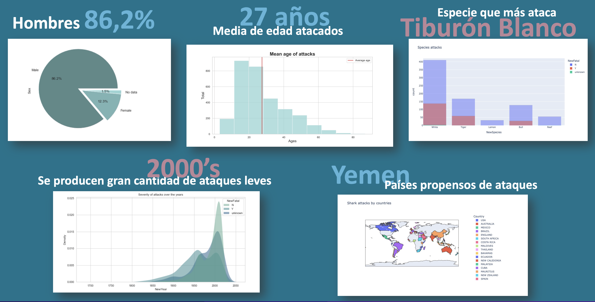

# Data-cleaning-pandas
Limpieza y análisis de datos

###### Archivos:
  * 1_clean.ipynb 
    Cuaderno de Jupyter Notebook con el análisis de la información original, limpieza de los datos y nuevo fichero.
  * 2_visualizations.ipynb 
    Cuaderno de Jupyter Notebook con las visualizaciones.

###### Carpetas:
  * data: Archivo con los datos limpios.
  * img: Imágenes de las gráficas resultantes.

#### Resumen:

#### Fuentes:
 * https://www.kaggle.com/teajay/global-shark-attacks
 * https://plotly.com/python-api-reference/
 * https://seaborn.pydata.org/
 * https://pypi.org/

![alt text][logo](https://www.google.com/url?sa=i&url=https%3A%2F%2Flogos-download.com%2F9988-python-logo-download.html&psig=AOvVaw0umgN_tIzcsGGWSb1dz_uU&ust=1643288783339000&source=images&cd=vfe&ved=0CAsQjRxqFwoTCNi_gfW9z_UCFQAAAAAdAAAAABAJ "icono")
